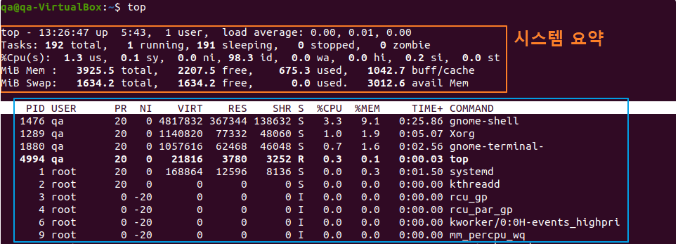

# 리눅스 명령어에 대한 조사

### ⭐ TOP 명령어란?
#### 실시간 프로세스 출력 (top)

```sh
$ top [옵션] # 시스템에서 현재 실행중인 프로세스에 대한 정보를 실시간으로 제공.
```

### 옵션과 의미

| 옵션 | 의미 |
|------|------|
| `-n` | 지정한 숫자만큼 화면 출력을 갱신한 후 종료 |
| `-u` | 지정한 사용자의 프로세스를 모니터링 |
| `-b` | 출력 결과를 파일이나 다른 프로그램으로 전달 |
| `-d` | 화면 갱신 주기를 초 단위로 설정 |
| `-p` | 지정한 PID 프로세스를 모니터링 |




#### top 명령어를 실행하면 사진처럼 최상단 5줄에 위의 정보가 우선적으로 출력된다. 그중에 가장 첫번째 라인의 top은 순서대로 "System time(현재 시간)", "System 구동 시간", "서버에 접속한 유저 수", "load average"를 보여준다.

* System time : 시스템의 현재 시간이다. date 명령어를 치면 나오는 시간과 같다.
* System 구동 시간 : 사진과 같은 경우 1 day, 10:54로 표시된 부분이며, 현재 1일 10:54 시간 동안 서버가 구동되고 있다.
* User : 현재 시스템에 연결된 사용자의 수이다.
* Load average : 해당 줄에서 가장 중요한 지표이다. CPU 부하에 관련된 지표이며, 왼쪽부터 1분 / 5분 / 15분에 대한 부하 수치이다.

#### Tasks는 5개의 지표로 나뉘어지는데, 각각의 지표를 통해 아래의 정보를 얻을 수 있다.

* total : 모든 상태의 프로세스 합계를 보여 줍니다.
* running : 요청을 처리하고 정상적으로 실행하며 CPU 액세스 권한을 가진 프로세스 수를 보여 줍니다.
* sleeping : 리소스를 대기 중인 프로세스를 나타냅니다. 이는 정상 상태입니다.
* stopped : 리소스를 종료하거나 해제하는 프로세스를 보고합니다. 이러한 프로세스는 상위 프로세스에 종료 메시지를 보냅니다.
* zombie : 부모 프로세스가 릴리스하기를 기다리는 프로세스를 말합니다. 부모 프로세스가 먼저 종료되면 고아가 될 수 있습니다.

#### %Cpu(s) 는 프로세스가 사용하는 CPU리소스에 대해 아래와 같은 자세한 지표를 보여준다.

* us : 사용자 프로세스 실행에 소요된 시간의 백분율입니다.
* sy : 커널 실행에 소요된 시간의 백분율입니다.
* ni : 수동으로 구성된 nice 값으로 프로세스를 실행하는 데 소요된 시간의 백분율입니다.
* id : 유휴 시간의 백분율입니다(높은 경우 CPU가 과도하게 사용될 수 있다고 판단).
* wa : 대기 시간의 백분율입니다(높은 경우 CPU가 I/O 액세스를 대기 중이라고 판단).
* hi : 하드웨어 인터럽트를 관리하는 시간의 백분율입니다.
* si : 소프트웨어 인터럽트를 관리하는 데 걸리는 시간의 백분율입니다.
* st : 물리적 CPU에 대한 액세스를 대기하는 가상 CPU 시간의 백분율입니다.

#### MiB Mem 은 시스템이 가진 Memory에 대한 사용률을 보여준다.

* total : 설치된 총 메모리를 보여 줍니다.
* free : 사용 가능한 메모리를 보여줍니다.
* used : 사용된 메모리를 보여줍니다.
* buff/cache : 쓰기 위해 버퍼링되는 정보의 양을 보여줍니다.

####  MiB Swap Linux는 스토리지 디스크에서 스토리지 공간을 빌려 물리적 메모리 공간을 사용할 때 
가상 메모리를 활용할 수 있는데, 물리적 RAM과 스토리지 드라이브 간에 데이터를 주고 받는 프로세스는 시간이 많이 걸리고 시스템 리소스를 사용하므로 가상 메모리 사용을 최소화 하거나, DB프로세스등 중요한 프로세스가 메모리 부족(OOM)으로 중지되지 않도록 권장하는 설정만큼 분배하는 것이 있다.

***

### ⭐ PS 명령어란?
#### 프로세스 출력 (ps)

* #### 리눅스는 다중 사용자, 사용 작업 시스템이기 때문에 여러 개의 프로세스를 동시에 수행하기 때문에 항상 어떤 프로세스들이 실행되고 있는지 모니터링할 필요가 있다.
* #### 따라서 현재 시스템에서 실행 중인 프로세스에 관한 정보를 출력하여 사용자에게 정보를 제공하는 명령어가 필요한데 이때 사용하는 명령어가 ps이다.
* #### 윈도우에서 특정 프로세스가 실행 중인지 확인하거나 강제 종료하기 위해 작업 관리자를 사용하듯이, 리눅스에서는 ps 명령어가 자주 사용된다.
* #### 특히 GUI를 사용하지 않는 서버 환경에서는 대부분의 프로세스들이 백그라운드에서 동작하기 때문에 특정 프로세스가 동작 중인지 확인하기 위해서 많이 쓰인다.

```sh
$ ps [옵션] 
# /proc 디렉터리 이하에 프로세스와 연관된 가상 파일시스템의 내용을 토대로 프로세스 정보를 출력.
```

[기본 프로세스 출력 옵션]

a : 터미널과 연관된 프로세스만 출력
x : 터미널과 연관되지 않는 프로세스만 출력
-A : 모든 프로세스 출력 (-e와 동일)
-e : 모든 프로세스 출력
-a : 세션 리더와 터미널과 연관되지 않은 프로세스를 제외하고 모든 프로세스를 출력

 

 

[지정한 프로세스 출력]

p : 지정한 PID 목록의 정보만 출력
-C : 지정한 프로세스의 실행 파일 이름의 정보만 출력
-u : 특정 사용자의 프로세스 정보를 출력


[프로세스 표시 형식]

u : 프로세스의 소유자 정보를 함께 출력
l : BSD 형식의 긴 형식으로 출력
e : 프로세스 정보와 함께 프로세스의 환경변수 정보도 출력
-l : 긴 포맷으로 출력
-o : 사용자 정의 형식 지정 가능


[프로세스 장식]

f : 프로세스 계층을 텍스트 형식의 트리구조를 보여줌.
-f : 전체 포맷으로 출력

### 옵션과 의미

| 옵션 | 의미 |
|------|------|
| `a` | 터미널과 연관된 프로세스 출력. 보통 `x` 옵션과 연계하여 모든 프로세스를 출력할 때 사용 |
| `e` | 프로세스에 관련된 환경 변수 정보 출력 |
| `f` | 프로세스 간 상속 관계를 트리 형식으로 출력 |
| `l` | 프로세스의 정보를 길게 보여줌 |
| `u` | 프로세스의 소유자를 기준으로 출력 |
| `x` | 터미널에 종속되지 않는 프로세스 출력 |
| `p` | 지정한 프로세스 출력 |
| `-a` | 세션 리더를 제외하고 터미널에 종속되지 않은 모든 프로세스 출력 |
| `-A` | 모든 프로세스 출력 |
| `-C [process]` | 뒤에 입력된 프로세스만 출력 |
| `-e` | 모든 프로세스 출력 |
| `-f` | 유닉스 스타일로 출력 |
| `-o [value]` | 출력 포맷을 지정함, 값에는 `pid`, `tty`, `time` 등을 지정함 |

### 프로세스 항목과 의미

| 프로세스 항목 | 의미 |
|--------------|------|
| `F`          | 프로세스 플래그 |
| `S`          | 프로세스 상태 코드 |
| `UID`        | 프로세스 소유자 이름 |
| `PID`        | 프로세스 고유 식별자 |
| `PPID`       | 부모 프로세스의 PID |
| `C`          | 프로세서 사용률 %로 표기 |
| `PRI`        | 프로세스의 우선순위. 높은 값이 낮은 우선순위 |
| `NI`         | nice 값이며 19에서 -20 값 |
| `SZ`         | 프로세스 이미지가 차지하는 물리적 페이지 크기 |
| `WCHAN`      | 대기 중일 때 커널 함수의 이름 |
| `STIME`      | 프로세스가 시작한 시간 |
| `TTY`        | 터미널의 종류 |
| `TIME`       | 총 CPU 사용 시간 |
| `CMD`        | 프로세스의 실행 시 명령줄 |

***

### ⭐ JOBS 명령어란?
#### 작업의 상태를 표시하는 명령어(JOBS)
```unix
$ jobs [옵션][작업번호]
```
### jobs 명령어는 현재 쉘 프로세스의 자식 백그라운드 프로세스들을 보여준다고 생각하면 된다.

### 백그라운드 작업의 상태값

| 상태                   | 설명 |
|------------------------|------|
| `Running`              | 작업이 계속 진행 중임 |
| `Done`                 | 작업이 완료되어 0을 반환 |
| `Done(code)`           | 작업이 종료되었으며 0이 아닌 코드를 반환 |
| `Stopped`              | 작업이 일시 중단 |
| `Stopped(SIGTSTP)`     | SIGTSTP 시그널이 작업을 일시 중단 |
| `Stopped(SIGSTOP)`     | SIGSTOP 시그널이 작업을 일시 중단 |
| `Stopped(SIGTTIN)`     | SIGTTIN 시그널이 작업을 일시 중단 |
| `Stopped(SIGTTOU)`     | SIGTTOU 시그널이 작업을 일시 중단 |

### 옵션과 설명

| 옵션  | 설명 |
|-------|------|
| `-l`  | 프로세스 그룹 ID를 state 필드 앞에 출력 |
| `-n`  | 프로세스 그룹 중에 대표 프로세스 ID를 출력 |
| `-p`  | 각 프로세스 ID에 대해 한 행씩 출력 |
| `command` | 지정한 명령어를 실행 |

***

### ⭐ KILL 명령어란?
#### Linux에서 프로세스를 종료하는 방법 (kill)

리눅스 운영체제에서는 프로세스를 관리하는 여러 가지 방법을 제공합니다. 그 중 하나는 kill 명령어를 사용하여 프로세스를 종료하는 것입니다. kill 명령어는 프로세스에 시그널(signal)을 보내어 원하는 동작을 수행할 수 있습니다. 프로세스 종료 외에도 다른 신호를 보내어 프로세스의 동작을 제어할 수도 있습니다.

#### kill 명령어의 기본 사용법
kill 명령어를 사용하기 위해서는 먼저 종료하려는 프로세스의 프로세스 ID(PID)를 알아야 합니다. 일반적으로 ps 명령어를 사용하여 현재 실행 중인 프로세스 목록을 확인한 후, 종료하려는 프로세스의 PID를 찾아야 합니다. 그런 다음 kill 명령어를 사용하여 해당 PID의 프로세스를 종료할 수 있습니다.

```unix
$ kill [옵션] <PID>
```

#### kill 명령어의 옵션
kill 명령어에는 다양한 옵션을 사용할 수 있습니다.

| 옵션                | 설명 |
|---------------------|------|
| `-s <signal>`       | 특정 시그널(signal)을 사용하여 프로세스를 종료합니다. 기본적으로 SIGTERM 시그널이 사용됩니다. |
| `-l`, `--list`      | 지원되는 시그널(signal) 목록을 출력합니다. |
| `-a`, `--all`       | 현재 사용자에 속한 모든 프로세스를 종료합니다. |
| `-q`, `--queue`     | 프로세스에 시그널을 보내는 대신 시그널을 대기열에 추가합니다. |

#### 예시
아래는 kill 명령어를 사용하여 프로세스를 종료하는 예시입니다:

* 현재 실행 중인 프로세스의 목록을 확인합니다: bash ps -ef

* 종료하려는 프로세스의 PID를 확인합니다.

* kill 명령어를 사용하여 해당 PID의 프로세스를 종료합니다: bash kill <PID>

#### 추가 정보
* kill 명령어를 사용하여 프로세스를 종료하는 것 외에도, kill 명령어를 활용하여 다른 동작을 수행할 수 있습니다.

* kill -l: 지원되는 시그널(signal) 목록을 확인할 수 있습니다.
* kill -9 <PID>: SIGKILL 시그널을 사용하여 강제로 프로세스를 종료합니다. 이는 프로세스를 멈추는 가장 강력한 방법이지만, 데이터 손실이 발생할 수 있습니다.
* killall <프로세스명>: 특정 프로세스 이름을 가진 모든 프로세스를 종료합니다.

#### 장단점
kill 명령어의 장점과 단점은 다음과 같습니다:

* 장점: - 간단한 명령어로 빠르게 프로세스를 종료할 수 있습니다. - 다양한 옵션을 사용하여 프로세스 동작을 제어할 수 있습니다.

* 단점: - 잘못 사용하면 의도치 않은 프로세스 종료가 발생할 수 있습니다. - SIGKILL 시그널을 사용하여 강제 종료할 경우, 프로세스가 올바르게 정리되지 않을 수 있고, 데이터 손실 등의 문제가 발생할 수 있습니다.

***
